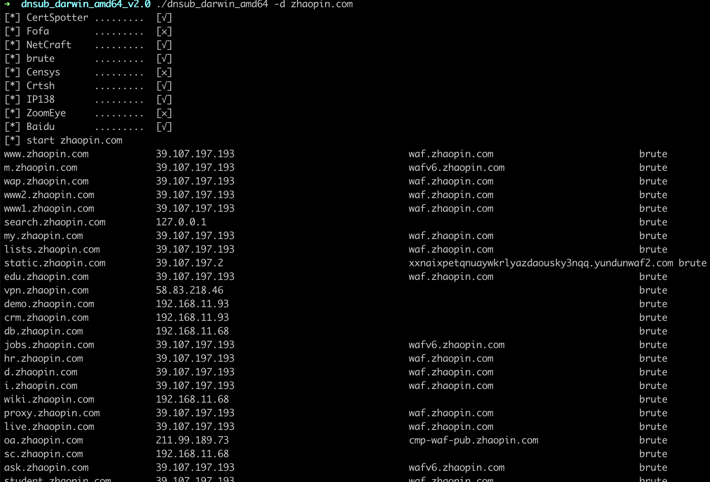
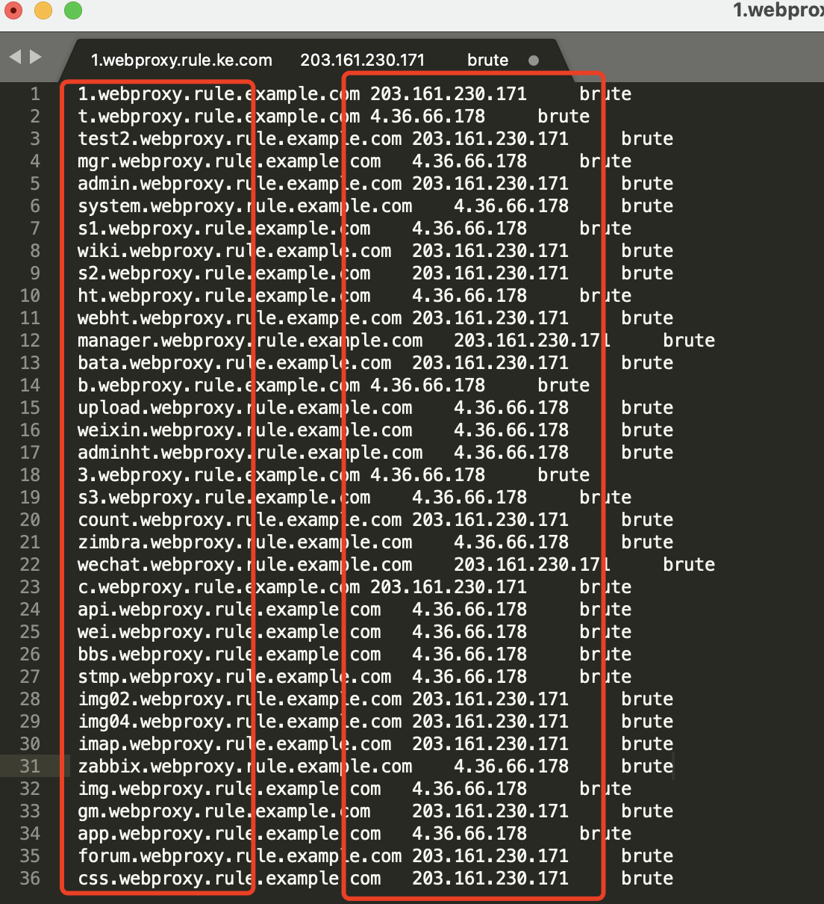
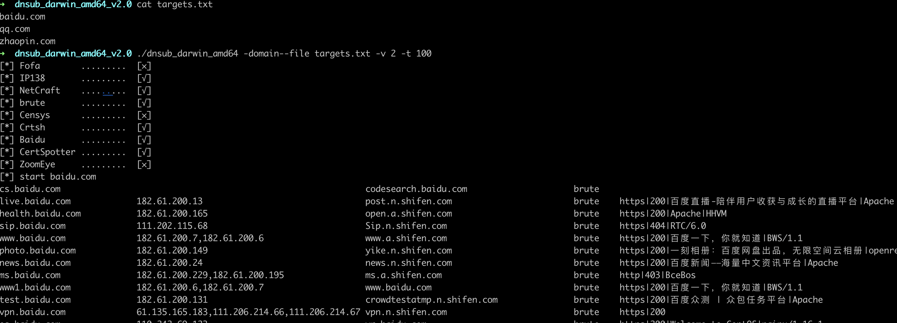

# dnsub

​		本工具通过**字典枚举、API查询、爬虫**的方式用于扫描探测子域名,意在帮助用户梳理子域名资产使用,dnsub使用`go`语言高并发扫描，并可展示 **子域名**、**IP** 、 **CNAME**、**域名信息**，处理了枚举中常见的泛解析问题，支持加载多个字典，枚举探测更多深度的子域名信息，帮助用户快速掌握域名资产，扫描速度快效率高且跨平台，希望这款工具能帮助你有更多的收获 : )

 [点击下载](https://github.com/yunxu1/dnsub/releases "Releases")

##### 参数: 

```shell
./dnsub_darwin_amd64 -h

[*] Censys      .........  [×]
[*] Fofa        .........  [×]
[*] ZoomEye     .........  [×]
[*] IP138       .........  [√️]
[*] brute       .........  [√️]
[*] Crtsh       .........  [√️]
[*] CertSpotter .........  [√️]
[*] Baidu       .........  [√️]
[*] NetCraft    .........  [√️]

example: dnsub -d example.com

  -d string
    	target domain  #子域名目标
  -debug
    	enable debug output log info #开启debug模式,可以看到工具执行详情,这个给我开发辅助调试用的..
  -depth int
    	enumerating subdomain depth using a param[f2] file content (default 2) #子域名爆破深度,默认2级
  -dns string
    	dns server address (default 9.9.9.9) #指定dns,默认9.9.9.9,选择一个速度快的dns可以提高你的枚举速度.
  -domain--file string
    	load domain list file path #加载一个域名列表批量爆破
  -dot
    	use dns-over-tls query dns infoarmation  #当你遇到dns污染可以开启此功能提高dns枚举的准确性
  -f string
    	load subdomain filepath. eg: dnsubnames.txt (default "dict/dnsubnames.txt") #设置加载字典路径
  -f2 string
    	load subdomain filepath. eg: dnsub_next.txt (default "dict/dnsub_next.txt") #设置2级以后字典路径
  -json
    	json output #开启输出json结果
  -o string
    	output result to csv,set file path. #指定结果输出路径,目前支持csv和json文本导出
  -prefix string
    	subdomain dictionary prefix Multi-line "," split #给枚举字典添加前缀
  -suffix string
    	subdomain dictionary suffix Multi-line "," split #给枚举字典添加后缀
  -t int
    	thread pool numbers (default 100) #设置线程数
  -timeout int
    	dns question timeout,unit is second (default 5) #设置枚举超时时间,默认5秒
  -v int
    	show verbose level (default 1) #设置显示的结果等级,默认2级
  -version #查看版本
    	show version
  -h	help #帮助
```


#### **API接口配置**

`dnsub_2.0`以上除了具备子域名枚举功能还增加了主流API接口的查询功能，目前收录的接口有：

| API         | 地址                      | 是否需要KEY |
| ----------- | ------------------------- | ----------- |
| Censys      | https://censys.io/        | 是          |
| Crtsh       | https://crt.sh/           | -           |
| CertSpotter | https://certspotter.com   | -           |
| Fofa        | https://fofa.so/          | 是          |
| ZoomEye     | https://www.zoomeye.org/  | 是          |
| Baidu       | https://www.baidu.com     | -           |
| IP138       | https://www.ip138.com     | -           |
| NetCraft    | https://www.netcraft.com/ | -           |
| -           | -                         | -           |

##### 如何配置接口key以及接口是否启用？

在dnsub目录下`config.ini`配置文件可以配置API是否启用以及key的配置,详情见`config.ini`配置模板。

这里以fofa为例：

```ini
[Fofa]
Enable = 1 ;是否开启接口查询,0为关闭,1表示开启
Email = admin@qq.com ;email
Key = 775d77f470007332c700f12a8b9e0c01 ;key
Timeout = 5 ;延迟时间
```

使用参数`-h`即可查阅加载配置加载情况

```
dnsub -h 

[*] ZoomEye     .........  [×]
[*] brute       .........  [√️]
[*] Censys      .........  [×]
[*] Crtsh       .........  [√️]
[*] CertSpotter .........  [√️]
[*] NetCraft    .........  [√️]
[*] Fofa        .........  [×]
[*] Baidu       .........  [√️]
[*] IP138       .........  [√️]
```


#### 开始使用

> ​	为了让你更快的学会使用dnsub这里我按照一些常见使用场景来介绍dnsub的使用及功能，你会发现他是一款简单易用轻便但强大的子域名收集工具。

**场景1：**简单扫描域名example.com

```shell
dnsub -d example.com
```



**场景2：**展示子域名的banner信息,并希望输出扫描结果到文件csv

​		这里可以设置参数 `-v 2` 提高展示结果的详情,主要展示内容有 **<u>协议、响应码、banner、标题</u>** 可以让你迅速对子域名信息有一个了解。

```shell
dnsub -d example.com -v 2 -o example.csv

# -v 2 设置展示等级
# -o 设置扫描结果输出到example.csv文件
```


> 当然你也可以选择使用`-json`参数输出json格式

**场景3：**我有一个超强的字典不想使用默认字典怎么解决？

​		dnsub提供`-f` 和`-f2`两个参数设置字典, 分别是设置子域名字典和2级以上的子域名字典的,可以使用这两个参数指定字典路径。

**场景4：**我想枚举3级4级的字典怎么解决？

​		使用参数 `-depth 3`即可枚举3级域名字典,你需要枚举多少级就写多少，只要你足够闲，你可以写2333。

**场景5：** 我发现目标子域名存在一定规律，比如pre-xxx.example.com,dev-xxx.example.com，这类子域名非常常见，通常用于测试环境，开发环境等使用的子域名，那么如何枚举呢？

		+ 使用`-prefix`参数可以设置域名前缀
		+ 使用`-suffix`参数可以设置域名后缀

​	该功能按需使用会给字典添加前后缀，是在原字典基础上添加的不会影响原字典的枚举结果,但请注意一定要填写子域名连接符号，比如 `pre-`和`pre.`。

```shell
dnsub -d example.com -prefix uat-,pre-,admin.

#设置域名前缀后枚举时字典会在原有字典基础增加如下：
uat-www.example.com
pre-www.example.com
admin.www.example.com


# -suffix功能同上
```

**场景6:**  我想加载一个超大字典挂在服务器上跑可以吗？这个必须可以，我经常这么干。

1.这里使用nohup将dnsub挂在服务器后台执行;

2.使用参数`-depth 3`设置枚举深度为3级

3.使用参数`-o` 设置输出到文件`example.csv`

4.使用参数`-t` 设置线程为200

5.使用参数`-f`加载一个超级大字典

```shell
nohup ./dnsub_linux_amd64 -d example.com -depth 3 -o example.csv -t 200 -f subdomains_big.txt > /dev/null &
```

> 当然你也可以选择使用`-json`参数输出json格式

**场景7:** 我遇到了dns污染，切换了dns还是没有用，枚举出的子域名都是假的，这可怎么办？

这里先说子域名污染是什么样的？子域名经过污染后无论你怎么查询域名dns他都会返回一个ip地址，这个ip地址不固定，但是你访问这个域名他却没有真实指向，这就导致枚举工具也经常枚举出一批垃圾信息。

如图：



​		dns污染经常会出现在一些webproxy、proxy等这类域名上，尤其在这类被污染的域名枚举3-4级以上基本都是垃圾结果，没有实际价值，为什么导致污染原因你懂得。

​		这里dnsub只需要使用`-dot`就可以解决dns污染问题，当然选择这个参数你的子域名枚举速度会变的非常慢，所以你需要指定一个速度比较快的dns,这里推荐阿里云，dns指向使用参数`-dns 223.5.5.5`

```
dnsub -d example -dot #开启dot模式，速度会变的超鸡曼，慎用
```

**场景8：**我有一批子域名列表想扫描，怎么解决？

第一步，你需要把这些子域名放入一个txt文本中每行一个；

```
cat targets.txt

baidu.com
qq.com
zhaopin.com
```

第二步，使用`-domain--file`参数指定一个目标列表，这里就*不需要使用`-d`参数了*

```shell
dnsub -domain--file targets.txt -v 2 -t 100

# -domain--file 指定子域名列表文件
# -v 2 设置展示等级用于展示banner信息
# -t 设置线程数为100
```



还是那个需求，我想把这批子域名列表挂在服务器扫描怎么解决？

```shell
nohup ./dnsub_linux_amd64 -domain--file targets.txt -depth 3 -o example.csv -t 200 -f subdomains_big.txt > /dev/null &

#把上一个场景的-d参数替换成-domain--file即可,就这么简单!
```

##### 版本更新记录:

2020/4/25
+ 优化泛解析识别;
+ 缩短打印行;
+ 优化域名访问探测,增强稳定性,忽略请求超时的域名;

2021/1/16
+ 增加了API及爬虫
+ 增加了模块加载打印信息
+ 增加了多子域名扫描功能
+ 增加了扫描结果输出json格式
+ 增加了枚举子域名前缀和后缀配置规则的功能
+ 修复了多线程下文本输出部分内容丢失的bug
+ 优化了配置加载
+ 优化了多域名加载

2021/1/19
+ 增加dns查询dot模式,用于解决dns污染导致查询不准的情况(此功能开启会影响扫描速度)
+ 优化了httpbanner获取功能
+ csv文本输出内容调整